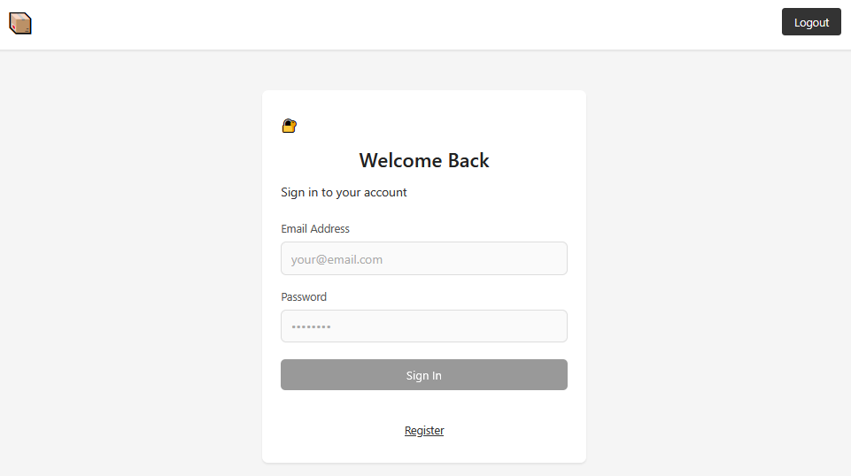
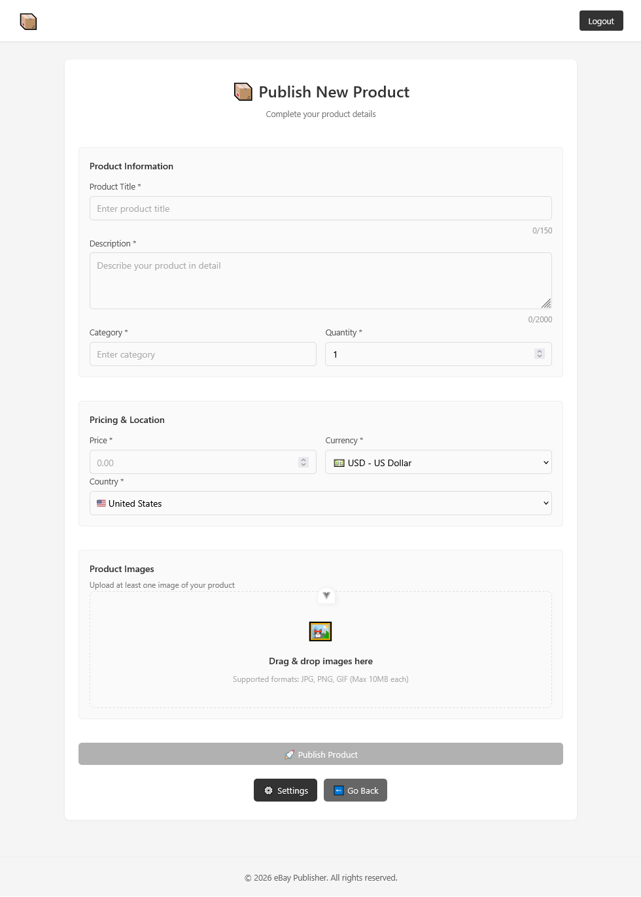

## Приложение для публикации товаров на маркетплейсы

sell-helper – Позволяет пользователю: по штрихкоду или названию товара получить его предзаполненные метаданные (имя, описание, и пр.), посмотреть аналоги, и затем — автоматически опубликовать объявление на маркетплейсе. В качестве системы поиска используется Perplexity. 

<b>Стек</b>
- Бекенд: Python, Poetry, FastAPI, Dishka, SQLAlchemy, Alembic, тесты - pytest
- Фронтенд: Vue
- БД: Postgres, Redis
- Docker

Проект реализован в соответствии с принципами чистой архитектуры.

### Примеры интерфейса 




### Примеры основных запросов

<b>Аутентификация:</b>
```bash
curl -X POST https://"${url}"/api/auth/login \
    -H 'Content-Type: application/json' \
    -d '{"email": "rand@mail.abc", "password": "123"}'
```
Ответ:
```json
{ "token": "<jwt-token>", "ttl": 1200 }
```

<b>Поиск категорий:</b>
```bash
curl -X POST "https://"${url}"/api/product/<marketplace>/recognize" \
  -H "Authorization: Bearer "${token}"" \
  -F "image=@/path/to/image.jpg;type=image/jpeg"
```

Ответ:
```json
{ "categories": [...], "product_name": "<product-name>" }
```

<b>Поиск информации о продукте:</b>
```bash
curl -X POST "https://"${url}"/api/product/<marketplace>/aspects" \
  -H "Content-Type: application/json" \
  -H "Authorization: Bearer "${token}"" \
  -d '{
    "product_name": "'"${name}"'",
    "category": "'"${category}"'"
  }'
```

Ответ:
```json
{
  "metadata": {
    "description": "<description>"
  },
  "metadata_type": "Metadata",
  "product": {
    "aspects": {
      "Brand": "<brand>",
      ...
    },
    "required": ["Brand", ...],
  }
}

```
<b>Публикация продукта</b>
```bash
curl -X POST "https://"${url}"/api/product/<marketplace>/publish" \
  -H "Authorization: Bearer "${token}"" \
  -F 'item={
    "title": "<title>",
    "description": "<description>",
    "category": "<category-name>",
    "price": 120.0,
    "currency": "RUB",
    "country": "RU",
    "quantity": 1,
    "product": {"Brand": "<brand>", ...},
    "marketplace_aspects": {...}
  }' \
  -F "images=@/path/to/image.jpg;type=image/jpeg"
```

Ответ:
```json
{"status": "success"}
```
